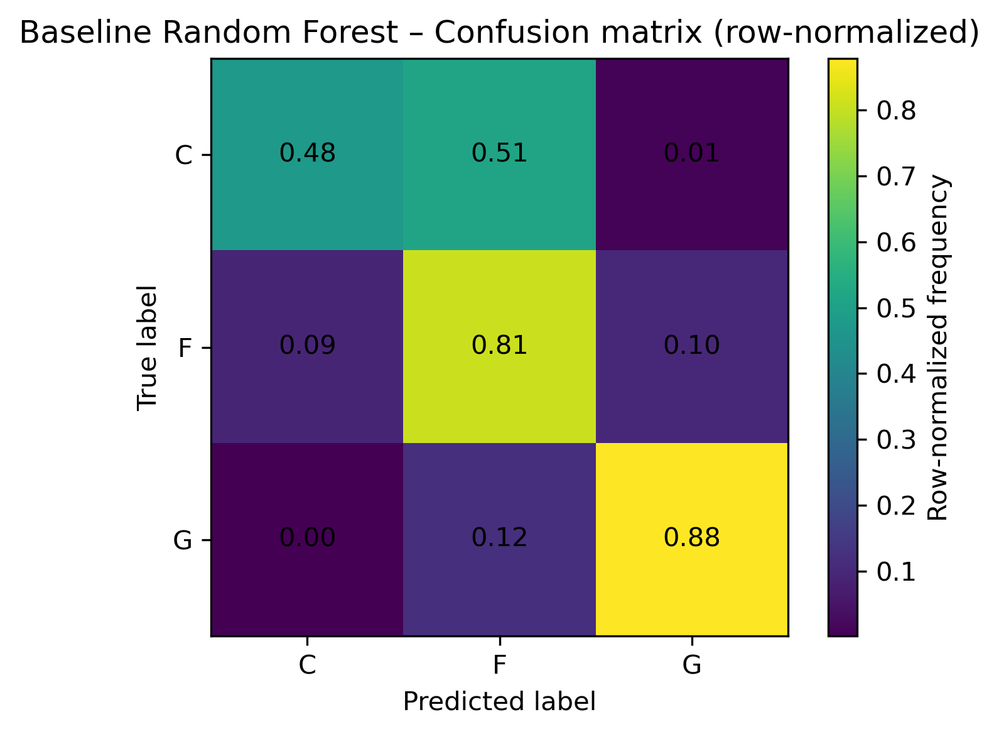
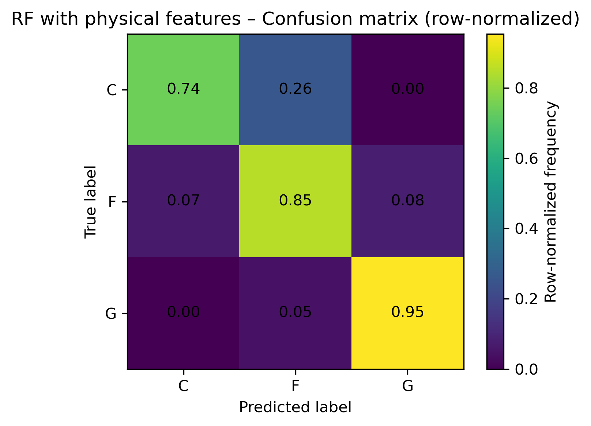
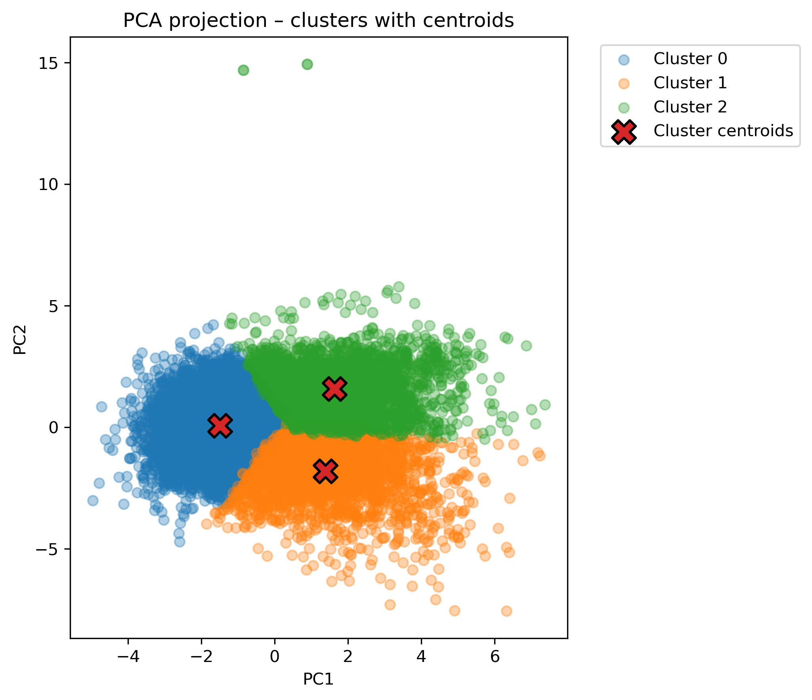
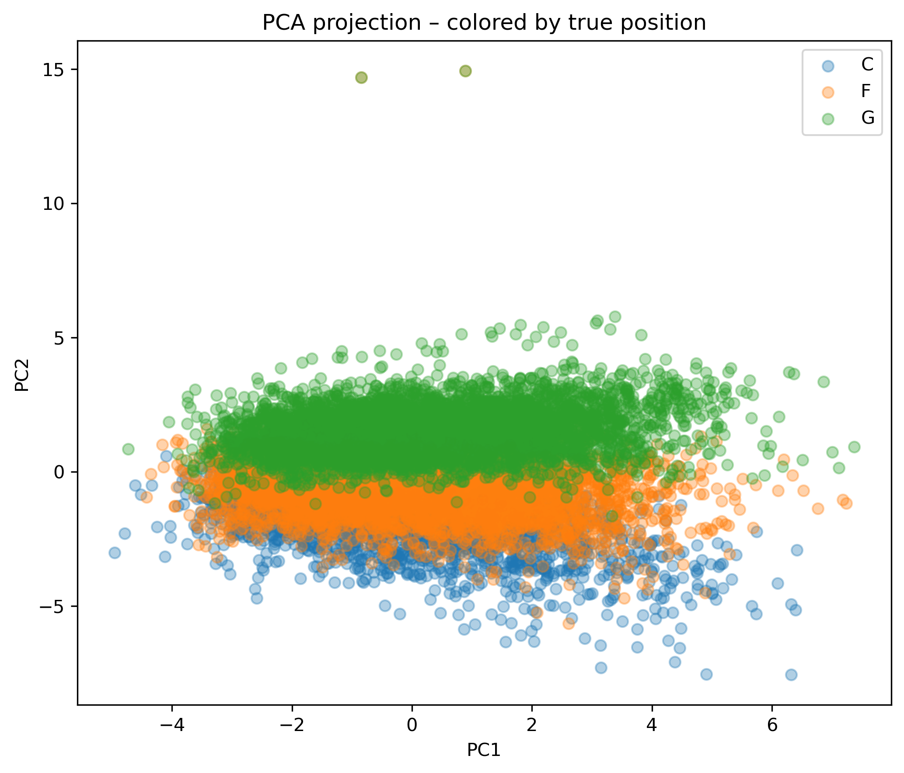

# Court_Dynamics_321641

# Court Dynamics – NBA Role Classification and Clustering  
### LUISS University – Machine Learning Project  
**Repository:** Court_Dynamics_321641  

**Team Members:**  
- Alessandro Geiss (Captain – Student ID: 321641)  
- Filippo Puggelli (Student ID: 315771)  
- Luca Giordani (Student ID: 317261)  
- Tommaso Mastromarino (Student ID: 319281)

---

# [Section 1] Introduction  

Understanding player roles is very important in basketball analytics, however, the traditional Guard–Forward–Center taxonomy is continuously challenged by more modern positionless play. This project uses machine learning to study how NBA roles emerge from objective data rather than from conventional labels. Using performance statistics, efficiency metrics, and physical attributes that we extracted from the `basketball.db` database, we build supervised models to classify players into their nominal positions and unsupervised models to explore the underlying role structure independent of labels.

The project integrates the entire ML pipeline: data cleaning, feature engineering, standardization, baseline model training, hyperparameter tuning via cross-validation, dimensionality reduction, clustering, and visualization. The results provide insights into how well the traditional `G/F/C` positions reflect statistical and physical traits, and allows us to understand how machine learning methods can reveal patterns in the structure of modern NBA player roles.

---

# [Section 2] Methods  

## 2.1 Data Source and Preprocessing  

We use the `basketball.db` database consisting of two primary tables:  

- `players`: static player-level information (height, weight, position labels)  
- `player_regular_season`: season-level totals and performance statistics  

These tables are merged on the unique player identifier `ilkid`. Each merged row corresponds to a **player-season**, allowing a detailed and focused view of player roles across multiple seasons.

### Data Cleaning  
To make sure there is statistical reliability, we remove low-information seasons by filtering for:  
- **≥ 20 games played**, and  
- **≥ 5 minutes per game**

This prevents outliers from distorting the feature space.

---

## 2.2 Feature Engineering  

We design two complementary feature sets:

### **1. Performance and Efficiency Metrics**  
Converted from raw totals into per-game values:  
- `pts_pg`, `min_pg`, `reb_pg`, `ast_pg`, `stl_pg`, `blk_pg`, `tov_pg`  
- Shooting efficiency: `fg_pct`, `ft_pct`, `tp_pct`

Rationale:  
Per-game normalization removes biases from unequal playing time and better represents a player's functional role.

### **2. Physical Attributes**  
- `height_in`  
- `weight`  

Rationale:  
Physical structure is deeply tied to positional responsibilities, and improves model ability to distinguish interior from perimeter players.

### Missing Values  
We apply **median imputation**, which is robust and consistent with class recommendations, especially relevant for variables like early-era three-point percentage.

---

## 2.3 Supervised Learning Pipeline  

Our classification pipeline follows the structure outlined in *02-Classification.pdf* and related course materials.  

### **Train / Validation / Test Split**  
- 80% train+validation  
- 20% test (held out permanently)  
- From train+validation:  
  - 60% → train  
  - 20% → validation  

### **Standardization**  
We fit `StandardScaler` **only on the training split** and apply it to validation and test sets.  
This prevents test-set leakage and ensures a fair evaluation.

### **Baseline Models**  
We train three classical ML models:  
- **Logistic Regression (multinomial)** – linear, interpretable baseline  
- **SVM (RBF kernel)** – non-linear model capturing curved decision boundaries  
- **Random Forest** – ensemble of decorrelated decision trees capturing non-linearities  

### **Hyperparameter Tuning**  
Using **5-fold cross-validation** on the combined train+validation set, we tune:

- Logistic Regression: `C`, `penalty`, `solver`  
- SVM: `C`, `gamma`, `kernel`  
- Random Forest: `n_estimators`, `max_depth`, `min_samples_split`, `max_features`  

Macro-F1 is used as the primary score, ensuring equal weight across classes (`G/F/C`).

### **Final Test Evaluation**  
The best models are retrained on the full train+validation data and evaluated on the untouched test set using:

- Accuracy  
- Macro-F1  
- Confusion matrices  
- Classification reports  

---

## 2.4 Unsupervised Learning Pipeline  

To study the latent structure of roles, we apply:

### **Principal Component Analysis (PCA)**  
- Reduces high-dimensional features to 2 interpretable components  
- Reveals dominant variation axes such as creation vs interior presence  

### **KMeans Clustering (k = 3)**  
- Groups players based on feature similarity  
- Enables comparison between organically emerging clusters and true positions  

### **Visual Diagnostics**  
We generate:  
- PCA scatter plots colored by cluster  
- PCA scatter plots colored by true position  
- Cluster centroids overlaid on PCA space  

These plots help interpret how clusters align with or differ from traditional role labels.

---

## 2.5 Environment & Reproducibility  

We provide full environment information to enable exact replication.

### **Conda Environment Export**
```bash
conda env export > environment.yml
```
---

# [Section 3] Experimental Design  

To validate the proposed ideas and assess the contribution of each modeling choice, we design two main experimental blocks: a supervised classification experiment and an unsupervised role-discovery experiment. Together, these experiments allow us to evaluate both predictive performance and structural interpretability.

---

## Experiment 1 – Supervised Position Classification  

### Main Purpose  
The first experiment evaluates whether NBA player positions (Guard, Forward, Center) can be predicted from engineered statistical features, and how predictive performance changes when physical attributes are introduced.

### Baselines  
We compare three widely used classification models:

- **Logistic Regression (multinomial):**  
  Serves as an interpretable linear baseline, allowing us to assess whether position classes are linearly separable in the feature space.

- **Support Vector Machine (RBF kernel):**  
  Introduces non-linearity and margin maximization, enabling more complex decision boundaries.

- **Random Forest:**  
  An ensemble of decision trees capable of modeling non-linear interactions between features and handling heterogeneous feature importance.

These models provide a progression from simple to more expressive classifiers, offering a meaningful comparison framework.

### Evaluation Metrics  
We evaluate each model on a held-out test set using:

- **Accuracy:**  
  Measures overall prediction correctness.

- **Macro F1-score:**  
  Gives equal importance to Guards, Forwards, and Centers, making it suitable for datasets with mild class imbalance.

- **Confusion Matrices:**  
  Used to analyze class-specific errors and understand which positions are most frequently confused.

The combination of these metrics provides both quantitative performance evaluation and qualitative insight into model behavior.

---

## Experiment 2 – Unsupervised Role Discovery via PCA and KMeans  

### Main Purpose  
The second experiment explores whether player roles naturally cluster in the feature space without using position labels. This allows us to examine whether traditional positions reflect underlying statistical structure or whether roles form more continuous groupings.

### Baseline and Reference  
Since unsupervised learning does not use labels, the baseline comparison consists of the **true position labels (G/F/C)**, which are used only for visualization and interpretation after clustering.

### Evaluation Approach  
We analyze clustering results using:

- **PCA explained variance:**  
  To verify that the first two components capture meaningful structure.

- **PCA scatter plots:**  
  Colored by both cluster assignments and true position labels.

- **KMeans diagnostics:**  
  Including inertia and silhouette score to assess cluster compactness and separation.

This experiment emphasizes interpretability rather than prediction accuracy.

---

# [Section 4] Results  

## 4.1 Supervised Learning Results  

The supervised classification experiments reveal several important findings:

1. **Models trained on performance statistics alone achieve reasonable accuracy**, particularly for Guards, whose statistical profiles (assists, usage, perimeter play) are more distinct.

2. **Forwards and Centers are frequently confused** in the baseline models. This reflects the reality of modern basketball, where many big players share overlapping statistical roles.

3. **Adding height and weight substantially improves classification**, especially for Centers. Confusion matrices show a much stronger diagonal, indicating clearer separation between interior and perimeter roles.

4. **Random Forest emerges as the most robust model**, consistently achieving the highest macro F1-score after hyperparameter tuning.

These results demonstrate that physical attributes provide essential structural information that performance metrics alone cannot fully capture.

---

## 4.2 Unsupervised Learning Results  

The unsupervised analysis complements the supervised findings:

- **PCA reveals interpretable latent dimensions**, separating ball-dominant, perimeter-oriented players from interior, rebound-focused players.

- **Guards form a compact and well-separated region** in PCA space, consistent with their distinctive role.

- **Forwards and Centers overlap substantially**, forming a continuum rather than two clearly separable groups.

- **KMeans clustering captures these patterns**, isolating a primarily Guard cluster while grouping many Forwards and Centers together.

Overall, the clustering results confirm that player roles are better understood as continuous spectra rather than rigid categories.

---

## 4.3 Figures and Visual Results  

All figures reported below are **generated directly from the Jupyter notebook** (`Court_Dynamics_final.ipynb`) and saved in the repository.

- **Confusion Matrix – Baseline Random Forest**  
  

- **Confusion Matrix – Random Forest with Physical Features**  
  

- **PCA Projection – KMeans Clusters**  
  

- **PCA Projection – True Positions (G/F/C)**  
  

These visualizations provide transparent insight into both model predictions and the structure of the feature space.

---

# [Section 5] Conclusions  

## Take-Away Summary  

This project demonstrates that NBA player roles can be partially inferred from statistical performance alone, but that **physical attributes are crucial for resolving positional ambiguity**, particularly between Forwards and Centers. Supervised models benefit significantly from feature engineering informed by domain knowledge, while unsupervised methods reveal that player roles form continuous structures rather than discrete classes. Together, these results illustrate the value of combining predictive accuracy with interpretability when analyzing real-world sports data.

## Limitations and Future Work  

Several important questions remain open. Player roles evolve over time, yet this analysis treats each season independently. Incorporating temporal modeling could capture career progression and role transitions. Additionally, advanced statistics such as usage rate, true shooting percentage, or defensive impact metrics may further refine role differentiation. Finally, clustering methods that allow soft assignments (e.g., Gaussian Mixture Models) could better represent hybrid players who span multiple roles.

Future extensions along these directions would provide a richer and more nuanced understanding of modern NBA positional dynamics.

---
